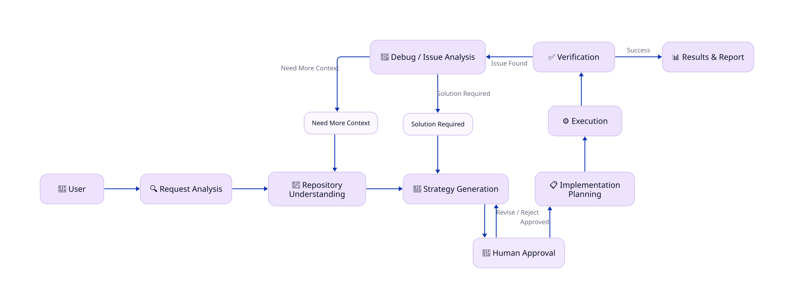

# Phy Coding Agent

An experimental agentic coding assistant focused on giving developers control over how AI modifies their codebase.

Instead of immediately changing the repository, the agent analyzes a task, proposes possible implementation paths, and lets the developer choose how to proceed.

## Philosophy

Instead of immediately modifying a codebase, Phy Coding Agent:

1. Understands the user's request
2. Investigates the repository
3. Identifies possible implementation approaches
4. Explains trade-offs
5. Lets the developer choose an approach
6. Creates an implementation plan
7. Executes the approved changes
8. Tests and verifies the result

## Principle

Phy Coding Agent is built around one principle:

        AI should not silently decide,
        how your codebase should change.

The agent should understand the problem,
present viable paths, explain trade-offs,
and let the developer decide what happens next.

## Planned Architecture

  

## Status

🚧 Early development

## License

This project is open source and licensed under the [MIT License](LICENSE).

The MIT-licensed code in this repository constitutes the project's open-source core, including its agentic coding capabilities, repository analysis, planning, context management, tool execution, and other functionality provided here.

Any future hosted services, cloud infrastructure, commercial services, or other components developed separately from this repository may be distributed under separate terms and may be proprietary. Such services are not required to use or run the open-source core locally.

The open-source core and any future hosted services are intended to remain separate components with clearly defined interfaces between them.

### Contributions

Contributions to this repository are welcome and will be licensed under the MIT License, subject to the terms of the project's contribution guidelines.
